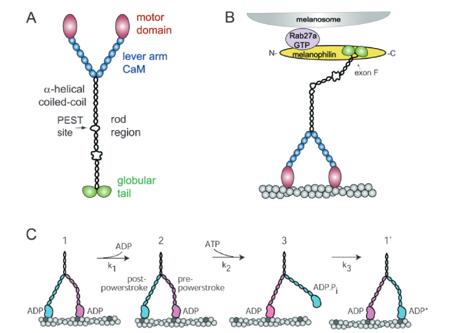
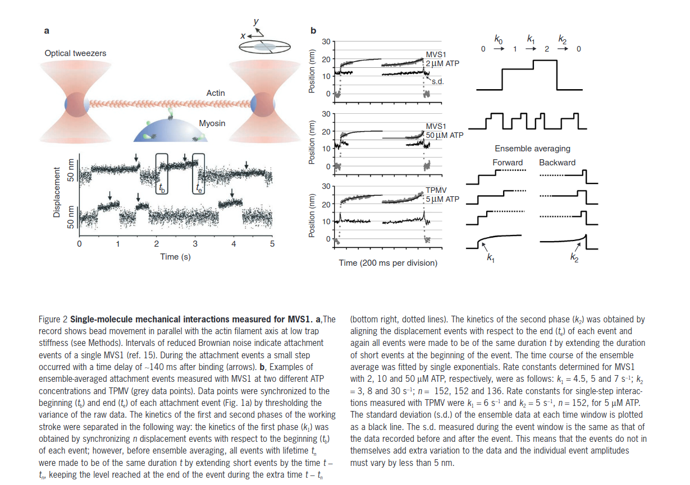
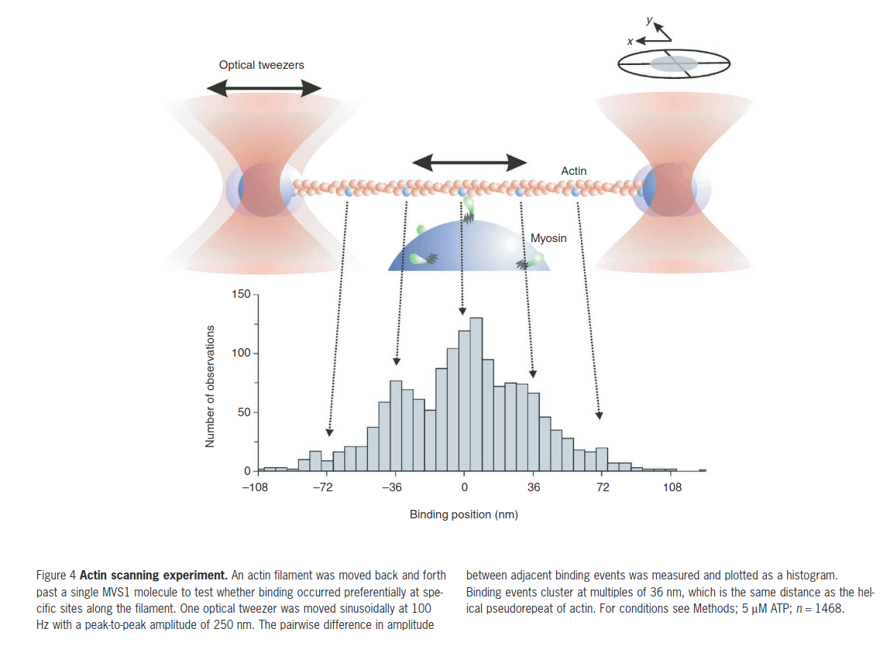

# Myosin V {#myoV}

This section contains general information about myosin V. 
***
## [Oguchi 2008](https://www.pnas.org/content/pnas/105/22/7714.full.pdf)

For processesive motors to walk, ADP-release and ATP binding to the trail head must have a higher probability.
 * intramolcular forces and loead dependence causes this. 
 
__Their question:__
> "it remains unclear whether head-head com-munication through the intramolecular load results solely ininhibition of ADP dissociation from the leading head, or,additionally, acceleration of ADP dissociation from the trailinghead...we use optical nanometry to examine the effectof applied external loads on individual actomyosin V and VIbonds to test the hypothesis that loads modulate biochemicalprocesses within the motor domain"

__(some) Results:__
*  ADP binding induces conformational re-arrangement of the actin-myosin binding interface
* ADP affinity of the trailing head is lower than that of the leading head
* Load Inhibits ADP Dissociation from the Leading Head in Myosin V 
*  ADP dissociation from the trailing head during processive stepping is reported to be only weakly accelerated (~2-fold) (7), if at all (4, 24),


 
 
***

## [Trybus 2009 - Myosin V from head to tail](https://link-springer-com.silk.library.umass.edu/content/pdf/10.1007/s00018-008-7507-6.pdf)

In humans 3 classes (Va - brain/melanocytes, Vb - epitheilial cells=, Vc - epithelial cells)
Important to transport pathways that move/anchor cargo at cell periphery

**MyoV has 4 strcutural domains**

1. Motor Domain
   + actin-binding site and nucleotide binding site

2. Lever Arm
   + 24-nm alpha-helix
   + 6 calmodulins (CaMs) aka light-chains

3. Rod Region
   + has 3 stretches of alpha-helical coiled-coils which help dimerize the molecule

4. Cargo binding domain (globular tail domain)
   + at the terminus binds adapter proteins to link to cargo



**MyoV Processive walking model**  

* Moves 36nm each step on surface of actin (pseudorepeats also ~36nm apart)
* Has a high duty ratio
* ATPase around 15/s
* Coordination via *intramolecular strain* to walk without floating off actin

**Mechanical State 1**  

* 2 heads strongly bound to actin w/ADP
* Trail head is post-powestroke, lead head is strained pre-powerstroke  

*Biochemical change: ADP is released by trail head at 12/s and is the rate limiting step in myoV*

**Mechanical State 2**

  * Trail head in rigor  
 
*Biochemical change: ATP binds trail head and dissociates*
  
**Mechanical State 3**

  * lead head can finish powerstroke
  * "thrusting" trailing/detached head forward while hydrolzing ATP repriming lever arm  

*Biochemical change: diffusive search for actin binding site, releases Pi*

**Mechanical State 1'**

   * the new lead head becomes strongly bond, strained, ADP* 
   * trail head still in ADP  

After ADP isomerization returned back to mechanical state 1  


**Motor Domain**

* Crystal structures of nucleotide-free myoV reveal coupling between cleft closure and disabling binding site
  + cleft closure involves large conformational changes in the so-called "transducer" (7-stranded beta sheets, loops, and linkers).
  + Verbatim the transducer..."which is the central region of the motor domain near the active site."
  + These changes disable active site by re-positioning P-loop, switch 1 & 2 (nucleotide binders)


When ATP binds the cleft open destroying the strong binding interface while lever arm is still down (post-powerstroke)


* Loop 2 is important for actin binding
  + at the actin binding interface
  + disordered when unattached, ordered when attached
  + positive charge
  + [determines run length (decreasing + charge decreased run length)](https://www.jbc.org/content/early/2007/07/18/jbc.M703968200.full.pdf)
  + Key for the high affinity 'weak-binding' state. Important for processivity and finding next actin spot


**Lever Arm**

* MyoV lever arm gas 6 IQ motifs (IQxxxRGxxxR, where x denotes any amino acid)
* ~23-25 AA between motifs
* can be described as 3-pairs of IQ-Motifs
* Each motif binds CaM or related light chain
* these do not have functional Ca2+ binding sites (there are 4 Ca2+ bindinges sites called EF-hands). 
* difference in rates if there is CaM vs another light chain (CaM slower at rebinding)
* May be flexible joint to enable elasticity in 4th IQ
* CaM binds strongly in absence of Ca2+ in unconvential myosins
* step size of monomeric myoV constructs containing one to six IQ motifs increases with lever arm length
* full-length monomeric myoV has a 25-nm working stroke - smaller than the 36-nm step taken by double head
* 36-nm step is combo  (25 nm + thermally driven diffusive movement 11nm )


**Rod Region**  

* can cut myoV with calpain at PEST region
* PEST sites are thought to decrease half-life of proteins (promoting rapid turnover)
* MyoVc does not have this PEST site
* Certain exons in Rod region can impart cargo carrying specificity 

**Globular tail domain**  

* C-terminal ~400AA
* 2 roles
  + cargo binding
  + stabilzation of the folded inhibited conformation
* Melanosomes are well-studied cargo
* can bind multiple cargoes

***

## [Veigel 2002 - The gated gait of the processive molecular motor, myosin V](https://www-nature-com.silk.library.umass.edu/articles/ncb732.pdf)

Propose a mechanical gating mechanism that coordinates the 2 heads. Human gait is smooth due to higher inertial forces vs. frictional resistance. Molecular motors are different - momentum is negligible and friction is large which would produce jerky movement interrupted by longer stall or 'dwell points'.

* [MyoV has high duty ratio >70% (Sweeney)](https://www.pnas.org/content/pnas/96/24/13726.full.pdf)
* ADP release around 10/s (similar to ATPase rate indicating rate-limiting step). 
* 36nm steps reported previously from laser trap [here](https://www-nature-com.silk.library.umass.edu/articles/23072) and [here](https://www-pnas-org.silk.library.umass.edu/content/pnas/97/17/9482.full.pdf)

In this study they used expressed myoV-S1 with full-length lever arm (6 IQ motifs) and intact myoV (both ~0.3um/s in motility). 



* **myoV-S1**
    + 16nm rapid displacement in first 10ms
    + additional 5nm after ~140ms
    + timing of hitch is [ATP]-dependent _~1/uMATP/s_
    
__Conclusion:__ " The working stroke produced by a single myosin V head is significantly  shorter  than  the  step  size  produced  by  dimeric  myosin V"


* __Intact myoV__ 
  + found mix of both single steps and processive runs
  + runs consist of about 15-20 steps
  + measured displacement of single steps (21-25nm)
  + average processive step 34-36nm
  + lower processivity than kinesin
  
  __Actin Scanning Experiment__
   Moved actin rapidly over a myoV-S1 and look for preferential binding.
  



__Conclusions:__ 36nm occurs in 2 steps:  

1. ~25nm workng stroke from lead head
  + this biases positions trail head into a forward direction
  + actin may have periodic energy profile w/minima at binding positions 36nm along surface
  
2. ~11nm from the diffusive search for actin-binding site 

* Dwell times of single interactions are much longer than the staircases steps during processive walks
  + showcasing the effect of internal strain on biochemical rates (i.e. load speeding/slowing ADP-release)
  + ADP-release is sped up 2x at saturation ATP
  
* "The second phase of the working stroke acts as a gate that is opened by the internal strain produced by the binding of head 2".
  + This increases coordination of the 2 heads' cycles, increasing processivity

* Probably takes around 20 steps _in vivo_ corresponding to length of actin filament in a cell (10-1000nm long)


You can label chapter and section titles using `{#label}` after them, e.g., we can reference Chapter \@ref(intro). If you do not manually label them, there will be automatic labels anyway, e.g., Chapter \@ref(methods).

Figures and tables with captions will be placed in `figure` and `table` environments, respectively.

```{r nice-fig, fig.cap='Here is a nice figure!', out.width='80%', fig.asp=.75, fig.align='center'}
par(mar = c(4, 4, .1, .1))
plot(pressure, type = 'b', pch = 19)
```

Reference a figure by its code chunk label with the `fig:` prefix, e.g., see Figure \@ref(fig:nice-fig). Similarly, you can reference tables generated from `knitr::kable()`, e.g., see Table \@ref(tab:nice-tab).

```{r nice-tab, tidy=FALSE}
knitr::kable(
  head(iris, 20), caption = 'Here is a nice table!',
  booktabs = TRUE
)
```

You can write citations, too. For example, we are using the **bookdown** package [@R-bookdown] in this sample book, which was built on top of R Markdown and **knitr** [@xie2015].
